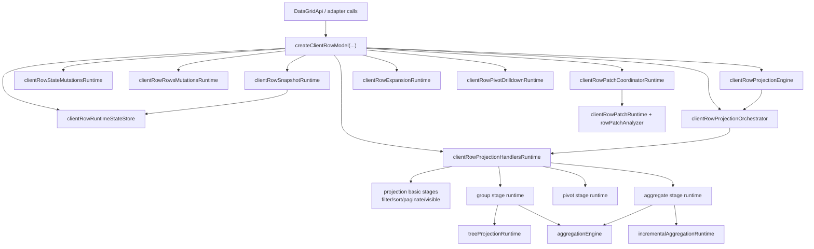

# DataGrid Client Runtime Diagram

Updated: `2026-03-02`

Scope: client-side row model internals in `@affino/datagrid-core`.

## Runtime Map

## Ownership Boundaries

- `clientRowModel.ts`: composition root, lifecycle wiring, and public model API.
- `clientRowProjectionHandlersRuntime.ts`: stage-handler assembly + stage finalization policy.
- `clientRowPatchCoordinatorRuntime.ts`: orchestration for patch path only.
- `treeProjectionRuntime.ts` / `pivotRuntime.ts`: heavy projection subsystems.
- `incrementalAggregationRuntime.ts`: delta application path for group/tree aggregation.

## Intent

The split is not for abstraction count.  
It keeps the core orchestration readable while preserving deterministic projection behavior and patch performance paths.

