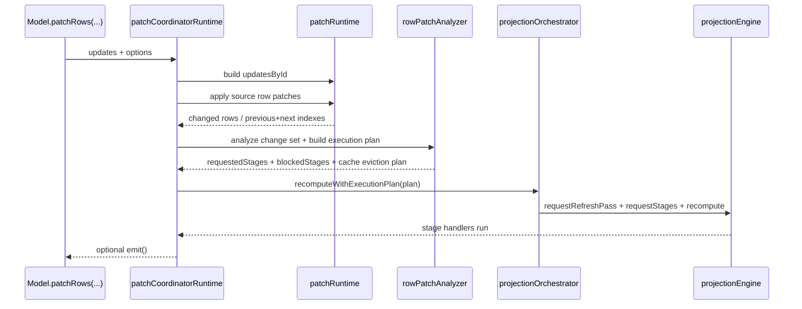

# DataGrid Mutation Flow

Updated: `2026-03-02`

Scope: how row and model mutations propagate to projection state.

## Mutation Families

| Mutation | Runtime Path | Default Recompute Behavior |
| --- | --- | --- |
| `setRows` | `clientRowRowsMutationsRuntime` | full projection from `filter` |
| `reorderRows` | `clientRowRowsMutationsRuntime` | projection from `filter` |
| `patchRows` | `clientRowPatchCoordinatorRuntime` | freeze view by default (`recompute*` are opt-in) |
| `setSortModel`, `setFilterModel`, `setGroupBy`, `setPivotModel`, `setAggregationModel`, pagination/viewport | `clientRowStateMutationsRuntime` | targeted stage recompute |

## `patchRows` Sequence

## Patch Policy

- Patch path first updates source rows and row versions.
- Dependency graph expands `changedFields` into `affectedFields`.
- Stage invalidation and `blockedStages` are computed declaratively from stage rules.
- Cache plan is explicit:
  - clear/evict sort cache,
  - invalidate tree caches or patch tree cache rows by identity.

## Freeze vs Reapply

- Default patch behavior is Excel-like freeze:
  - `recomputeFilter=false`
  - `recomputeSort=false`
  - `recomputeGroup=false`
- Reapply can be requested per patch (`true`) or via explicit refresh/recompute command.

## Determinism Guardrails

- Projection refresh pass is always requested in patch-plan recompute so each stage can patch identity.
- `blockedStages` keep stale diagnostics honest instead of silently pretending recompute happened.
- Final projection commit increments cycle versions in one place (`runtimeStateStore.commitProjectionCycle`).

